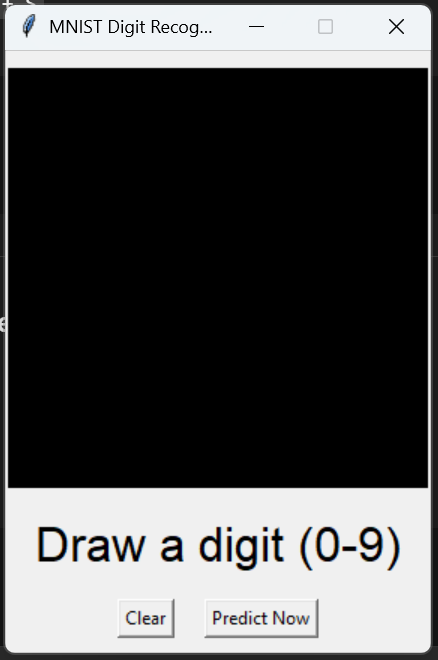

# Handwritten Digit Recognition using CNN (MNIST)

This project implements a **Convolutional Neural Network (CNN)** to recognize handwritten digits (0–9) using the **MNIST dataset**.
It also includes a **GUI application** that allows users to draw digits and get real-time predictions.

---

## 📌 Features
- CNN-based deep learning model
- Trained on MNIST dataset
- Accuracy > 98%
- Training & validation accuracy/loss visualization
- Confusion matrix analysis
- Tkinter-based GUI for live digit recognition

---

## 🧠 Model Architecture
- Conv2D + ReLU
- MaxPooling
- Dropout for regularization
- Fully connected Dense layers
- Softmax output layer

---

## 📊 Results

### Training & Validation Performance


### Confusion Matrix


---

## 🖥️ GUI Demo
Users can draw digits on a canvas and the trained CNN predicts the digit with confidence score.

---

## 🚀 How to Run

### 1️⃣ Install Dependencies
```bash
pip install -r requirements.txt

## Note
The trained CNN model file is not included due to size limitations.
Run train_mnist.py to generate the model.

## GUI Demo



